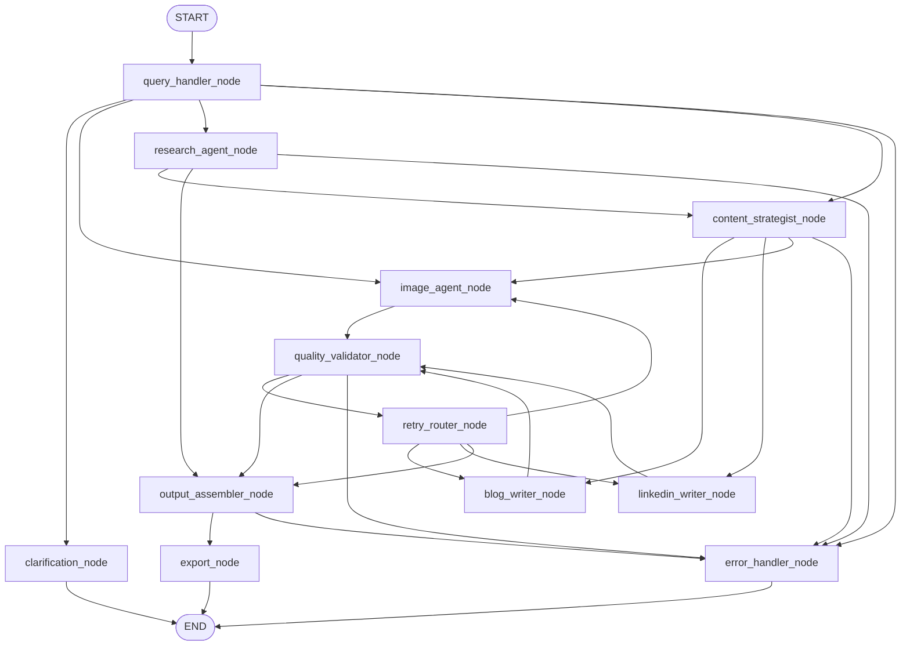

# ContentBlitz

ContentBlitz is a LangGraph-based multi-agent content orchestration system with a Streamlit UI, export pipeline, persistence/restore flow, and deterministic mocked validation as the default safety gate.

## Current Implementation

- 12-node authoritative workflow graph is active.
- Provider-backed tools are integrated for:
  - text generation with model policy defaults (`gpt-4o` with `gpt-4o-mini` fallback by default)
  - SERP search with Perplexity fallback
  - Stability AI image generation with fal.ai fallback
- Streamlit UI tabs are implemented:
  - Create
  - History/restore page
  - About page
- Export formats implemented:
  - Markdown, HTML, PDF, DOCX
- Guardrails implemented:
  - prompt-injection detection/sanitization
  - output sanitization
  - citation/source validation
  - export payload validation
- Session persistence and restore are implemented with safe serialization.
- Unit/integration tests are deterministic and non-live by default.
- Performance summary and timing metadata are exposed through safe UI rendering from orchestration progress metadata.

## Node Architecture



### Current Application Flow

- `query_handler_node` is the entry router for clarification, image, research, or strategist paths.
- `research_agent_node` either continues to strategist or bypasses to assembler for research-only requests.
- `content_strategist_node` fans out to `blog_writer_node`, `linkedin_writer_node`, and/or `image_agent_node`.
- `quality_validator_node` routes either to `retry_router_node`, `output_assembler_node`, or `error_handler_node`.
- `retry_router_node` loops targeted retries back to writer/image nodes, or returns to assembler.
- `output_assembler_node` sends exportable output to `export_node`, with failures routed to `error_handler_node`.

## Setup

```bash
python -m venv .venv
```

Windows (PowerShell):

```powershell
.venv\Scripts\Activate.ps1
pip install -r requirements.txt
```

macOS/Linux:

```bash
source .venv/bin/activate
pip install -r requirements.txt
```

## Environment Variables

Core provider and optional live-test flags:

```env
OPENAI_API_KEY=
SERP_API_KEY=
PERPLEXITY_API_KEY=
STABILITY_API_KEY=
FAL_API_KEY=
CONTENTBLITZ_RUN_LIVE_TESTS=0
CONTENTBLITZ_RUN_LIVE_IMAGE_TESTS=0
CONTENTBLITZ_ENABLE_LIVE_CALLS=1
```

Phase 4 observability (optional LangSmith tracing):

```env
LANGSMITH_TRACING=false
LANGSMITH_API_KEY=
LANGSMITH_ENDPOINT=https://api.smith.langchain.com
LANGSMITH_PROJECT=ContentBlitz
CONTENTBLITZ_TRACE_SAMPLE_RATE=1.0
CONTENTBLITZ_TRACE_FAILURE_SAMPLE_RATE=1.0
CONTENTBLITZ_RUN_LANGSMITH_SMOKE=0
```

Notes:

- tracing is disabled by default unless `LANGSMITH_TRACING` is truthy and `LANGSMITH_API_KEY` is present
- missing LangSmith credentials must not block normal startup, workflow runs, unit tests, or integration tests
- `CONTENTBLITZ_RUN_LANGSMITH_SMOKE` only gates the optional live smoke script

Runtime controls:

- `CONTENTBLITZ_ENABLE_LIVE_CALLS` is the global provider-call gate used by text/search/image tools.

Text model policy controls:

```env
CONTENTBLITZ_TEXT_PROVIDER=openai
CONTENTBLITZ_TEXT_MODEL_DEFAULT=gpt-4o
CONTENTBLITZ_TEXT_MODEL_FALLBACK=gpt-4o-mini
CONTENTBLITZ_AGENT_MODEL_POLICY=
```

Cache configuration (optional; default backend remains in-memory if unset):

```env
CONTENTBLITZ_CACHE_BACKEND=sqlite
CONTENTBLITZ_CACHE_TTL_SECONDS=1800
CONTENTBLITZ_CACHE_SQLITE_PATH=.tmp/contentblitz_cache.sqlite3
```

UI/export/persistence directory overrides (optional):

```env
CONTENTBLITZ_EXPORT_DIR=exports
CONTENTBLITZ_SESSION_DIR=.contentblitz_sessions
```

## Security Baseline

- `.env` is never committed.
- API keys are read only from environment variables.
- Tools are stateless.
- State never stores secrets.
- Provider errors are normalized.
- Base64 image data is never stored in workflow state or persisted runs.
- Tracing must not mutate workflow state.
- Tracing must not alter routing, retry counts, or cost counters.
- Raw user input and raw provider payloads are excluded from trace metadata.
- Secrets are redacted before trace metadata is emitted.

## Validation and Testing

Phase 3 validation (non-live, deterministic):

```bash
python scripts/validate_phase3.py --dry-run
```

Phase 2 validation (non-live, includes live-test skip gating checks):

```bash
python scripts/validate_phase2.py
```

Unit and integration suite:

```bash
pytest tests/unit tests/integration --cov=contentblitz --cov-report=term-missing
```

Mocked performance regression contracts:

```bash
pytest tests/integration/test_phase5_performance_contracts.py tests/integration/test_phase5_performance_baseline.py
```

Phase 4 observability validation (non-live by default):

```bash
python scripts/validate_phase4.py
python scripts/dev/smoke_langsmith.py --dry-run
```

Optional live LangSmith smoke (explicit opt-in only):

```bash
CONTENTBLITZ_RUN_LANGSMITH_SMOKE=1 python scripts/dev/smoke_langsmith.py
```

Live tests are optional and skip by default:

```bash
pytest tests/live -rs
```

Optional live smoke:

```bash
python scripts/dev/smoke_phase2_live.py --dry-run
```

Optional live performance smoke (manual, opt-in):

```bash
CONTENTBLITZ_ENABLE_LIVE_CALLS=1 python scripts/dev/smoke_query_handler.py
CONTENTBLITZ_RUN_LIVE_TESTS=1 pytest tests/live/test_live_generate_text.py tests/live/test_live_search_web.py -rs
```

## Frontend Run Command

```bash
streamlit run frontend/app.py
```

UI startup does not require API keys and does not execute provider calls automatically.
`frontend/app.py` auto-loads `.env` at startup when `python-dotenv` is available.
Live calls are blocked when `CONTENTBLITZ_ENABLE_LIVE_CALLS=0`.

## Key Docs

- `docs/ContentBlitz_Execution_Spec.md`
- `docs/PHASE3_UI_ARCHITECTURE.md`
- `docs/EXPORT_SYSTEM.md`
- `docs/VALIDATION_FRAMEWORK.md`
- `docs/GUARDRAILS_AND_SANITIZATION.md`
- `docs/SESSION_PERSISTENCE.md`
- `docs/REDUCER_MERGE_STABILITY.md`
- `docs/PHASE2_INTEGRATIONS.md`
- `docs/PROVIDER_CONTRACTS.md`
- `docs/CACHE_ARCHITECTURE.md`
- `docs/COST_CONTROLS.md`
- `docs/PERFORMANCE_ARCHITECTURE.md`
- `docs/PROVIDER_MODEL_POLICY.md`
- `docs/IMAGE_PROVIDER_STRATEGY.md`
- `docs/OBSERVABILITY.md`
- `docs/PHASE4_OBSERVABILITY.md`
- `docs/TESTING_STRATEGY.md`
- `docs/TECHNICAL_DEBT.md`
- `docs/KNOWN_LIMITATIONS.md`
- `docs/PHASE2_LIVE_SMOKE_TESTS.md`
